# Alphine

###Primer paso entramos en la pagina oficial de alpine y nos descargamos el siguiente paquete.

###Cuando lo tengamos descargado creamos la virtualbox y desabilitaremos el audio y ponemos de disco ide la iso del apine
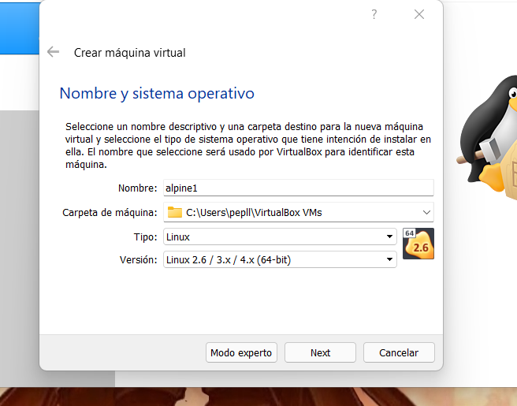

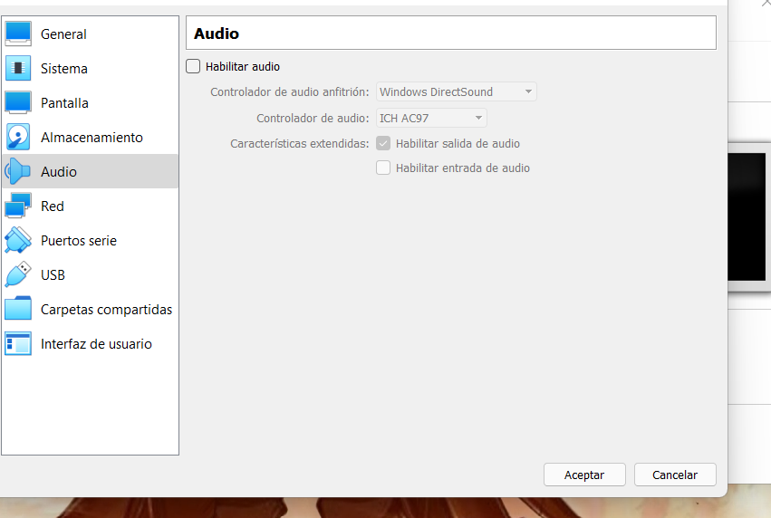

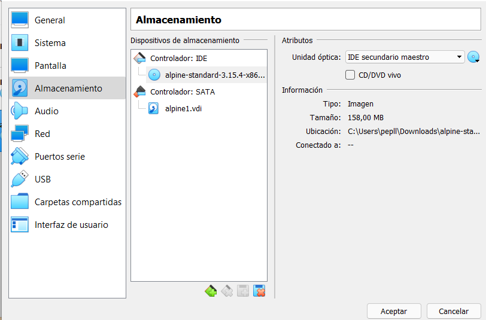

###Cuando ya tenemos la virtual box la podemos iniciar
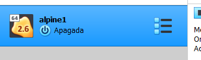

###Cuando ya estamos dentro tenemos que crear un locahost login y un localhost
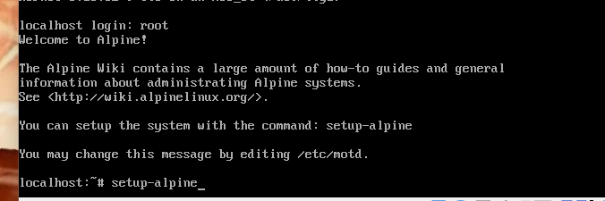

###Creamos una keyboard y un hostname
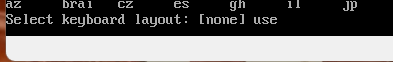

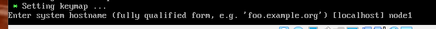

###Nos pedira poner una contraseña la que queramos
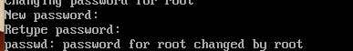

###Nos pedira la zona horaria y sub zona horaria

###Tenemos que elegir el disco en el que descargarlo el cual sera el sda y tenemos que esperar a la descarga

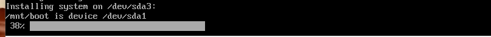

###Por ultimo tenemos que apagacr la maquina cambiar el adaptador de red y en sistemas quitar el orden de arranque optico y disquete y ya tendriamos instalado el alpine
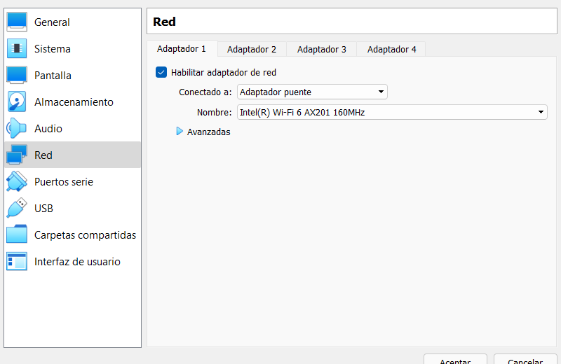

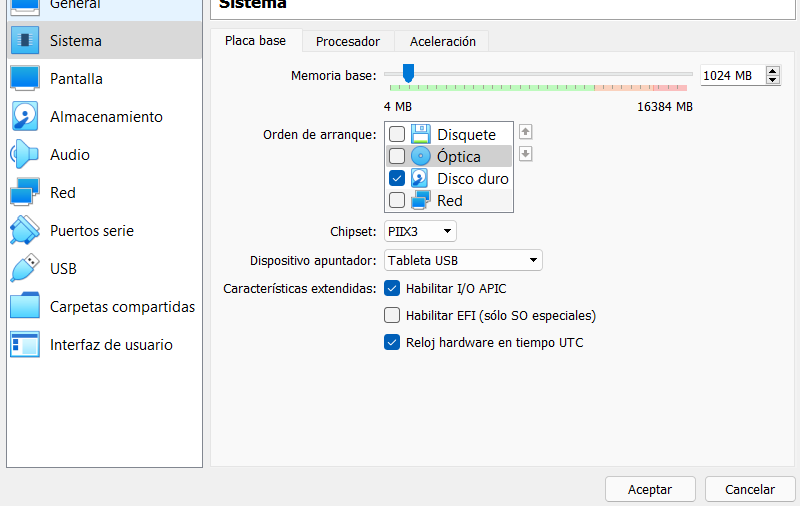

